## Schedule

* ✅ **19th Nov, 2023 - Sequential B+ tree implementation**

    Implemented a sequential version of B+ tree data structure and the corresponding infrastructures like test runner, unit test, etc.
    
* ✅ **22th Nov, 2023 - Coarse grained B+ tree implementation**

    Based on the sequential version, implemented a coarse-grain B+ tree with a global mutex lock, also implemented multi-thread benchmarking & testing modules.

* ✅ **25th Nov, 2023 - Fine grained B+ tree implementation**

    Based on the sequential version of B+ tree, implemented a fine-grained lock

* ✅ **3th Dec, 2023 - Lock free B+ tree (PALM Tree) implementation**

    Based on the intel paper of PALM algorithm, we implemented the latch-free B+ tree.

* ✅ **5th Dec, 2023 - Distributed B+ tree (OpenMPI) implementation**

    Based on the OpenMPI, implement a distributed B+ tree, where each process own a separate, local (partial) version of B+ tree.

* ✅ **7th Dec, 2023 - Optimizing Performance**

    Improve the performance of existing implementations by fine-tunining the details of codebase and clean up (utilize modern C++ features).

* ✅ **7th Dec, 2023 - Benchmark infrastructure (timing, statistics) implementation**

    Implement benchmark infrastructure (test-case generator, timing, performance evaluation, profiling, access pattern statistics, etc.) for all 5 different types of B+ tree implementations.

* **10th Dec, 2023 - Benchmarking the existing modules.**

    Perform benchmarking, collect and analyze the benchmarking result.

## Summary

In this final project, we plan to implement a series of B+ trees, including the sequential version, coarse-grain lock version, fine-grain lock version, the latch-free version (PALM Tree), and a distributed version based on OpenMPI. We will then conduct a comprehensive benchmarking on the performance of each data structure.

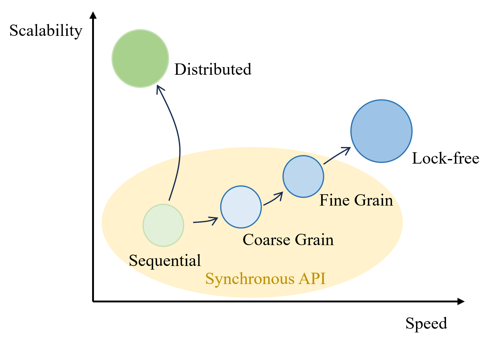

> \* *These are only estimated speedup based on the existing literatures, we have not-yet conducted benchmarking*

**Current Progress** - Up to now, we have implemented all 5 different versions of the B+ trees in the scope of this project: the sequential, coarse-grain lock, fine-grain lock, latch-free, and distributed B+ tree and have passed the correctness check.

## Preliminary Results

We have conducted correctness test for all 5 different trees' implementation. The screenshot for the Sequential, Coarse grain lock, Fine grain lock, and latch-free tree are shown below. We have not yet implemented a test engine for distributed tree.

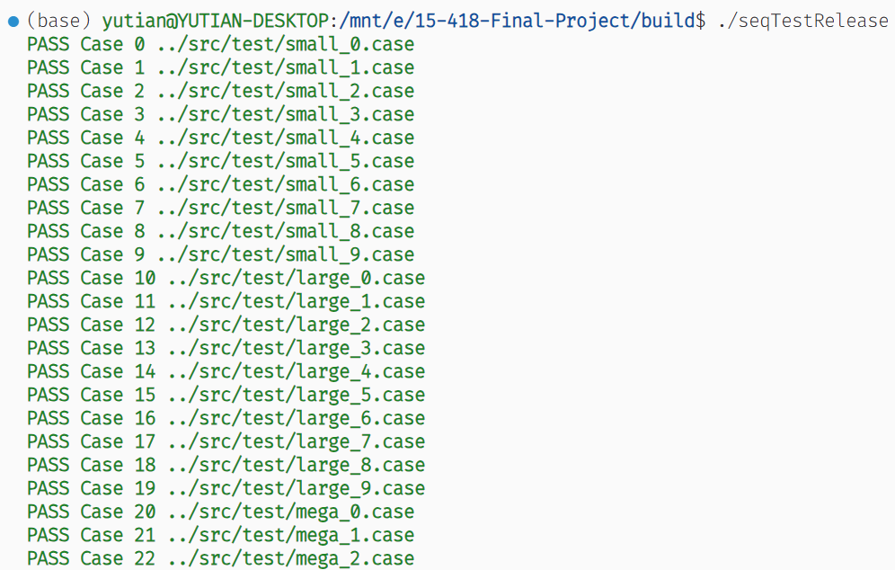
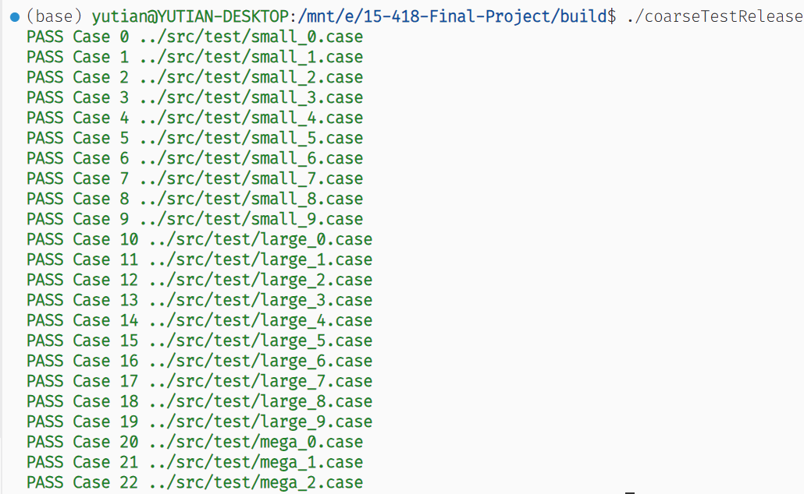
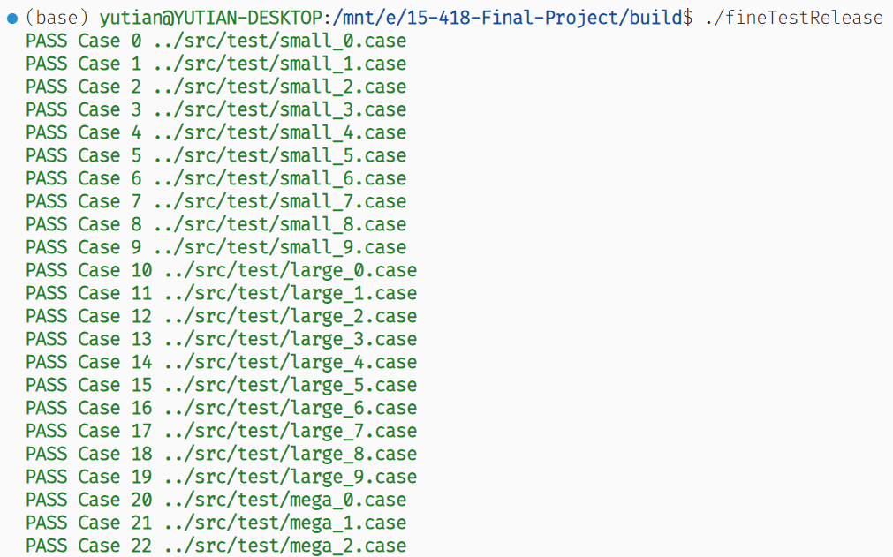
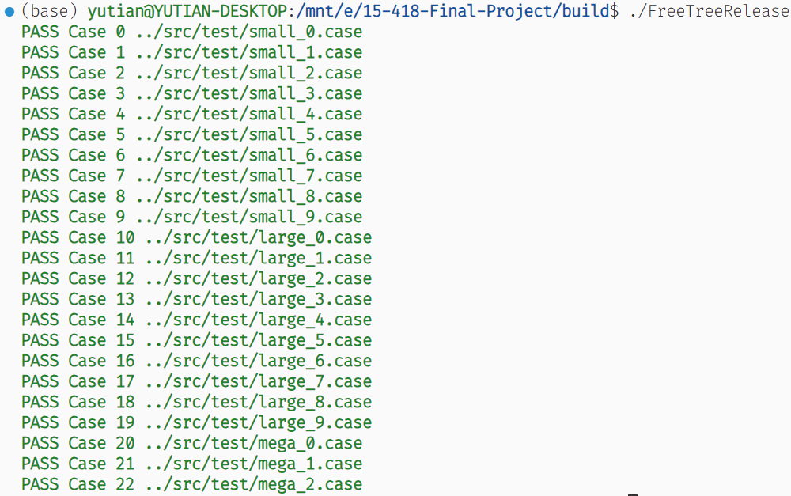

## Background

### B+ Tree

A B+ tree is a self-balancing tree data structure that maintains sorted data and allows searches, insertions, deletions, and sequential access in logarithmic time. Binary search tree is a specialization of B+ Tree. The B+ tree structure is well-suited for relational database management systems due to its balanced nature and ability to provide efficient range queries when it is used as index. In DBMS context, each internal node contains key ranges, which point to subtrees that contains data; each leaf node contains key/value pairs.

### Latch-free Data Structure

Latch-free data structures enhance concurrent programming by avoiding traditional locks, thus preventing common issues like bottlenecks and deadlocks in multi-threaded environments. They use atomic operations for safe concurrent access, offering significant performance improvements in high-concurrency scenarios. However, their complex design, which addresses challenges like the ABA problem, is a trade-off for these benefits.

### Parallelism with Message Passing Interface (OpenMPI)

OpenMPI is a key implementation of the MPI standard, vital in high-performance computing. It enables efficient parallel computing across multiple nodes by facilitating advanced communication methods like point-to-point and collective messaging. Known for its efficiency, portability, and scalability, OpenMPI is essential for complex computational tasks in distributed computing environments.

## Platform Choice

We decided to conduct our experiments and development on Linux platform using C++ language. Many important high performance computing (HPC) infrastructures like OpenMPI are easily available on Linux platform. C++ language provides a balanced layer of abstraction where developers have fine-grain control on the exact behavior of program while providing useful abstractions like smart pointer, and `std::atomic<T>`, which can significantly decrease the workload for developers.

## Challenge

1. Implementing hand-over-hand locking on B+ tree is hard by itself as the protocol allows multiple threads to access/modify B+ Tree at the same time. When navigating down the tree, we need to get lock for parent, and get lock for child, and release lock for parent if “safe”, which means that no split or merge when updated (i.e. not full on insertion, more than half-full on deletion).
2. Lock free programming is very hard to design and implement correctly, even with the help of `std::atomic<T>`.
3. Though OpenMPI allows us to scale up the parallelism on various hardware foundations (NUMA or single multi-core processor), it also provides a non-negligible overhead on the overall performance of program.

## Resources

1. Experiment Platform
    
    Since we plan to use OpenMPI to construct a large-scale parallelism N-body simulator, we will need to use the Bridge2-Regular Memory (Bridge2-RM) nodes in Pittsburgh Super Computing (PSC) for benchmarking.
    
    For the remaining parts of this project, we can conduct experiment on GHC cluster machines.
    
2. Papers on B+ tree concurrency
    
    [1] Bayer, R., Schkolnick, M. Concurrency of operations on *B*-trees. *Acta Informatica* **9**, 1–21 (1977). https://doi.org/10.1007/BF00263762
    
    [2] Sewall, J., Chhugani, J., Kim, C., Satish, N., & Dubey, P. (2011). PALM: Parallel Architecture-Friendly Latch-Free Modifications to B+ Trees on Many-Core Processors. Proceedings of the VLDB Endowment, 4(11), 795–806. https://doi.org/10.14778/3402707.3402719
    
    [3] Srinivasan, V., Carey, M.J. Performance of B+ tree concurrency control algorithms. *VLDB Journal* **2**, 361–406 (1993). https://doi.org/10.1007/BF01263046
    

## Goals and Deliverables

1. ✅ Implement a sequential version of B+ Tree
2. ✅ Implement concurrent B+ tree by coarse grained lock
3. ✅ Implement concurrent B+ tree by fine grained lock
4. ✅ Implement lock free B+ tree
5. ✅ Implement distributed B+ tree via OpenMPI
6. ✅ Perform benchmark testing on Synthetic sequence of read/write to a randomly generated B+ tree under parallel accessing.
7. ✅ Analyze the benchmarking result, calculate speedup and other statistics 
8. ⏳ Perform benchmark testing on Synthetic sequence of adversarial (worst-case) read/write to a manually-designed B+ tree under parallel accessing.

## Data Structure Design

### Coarse-grain B+ Tree

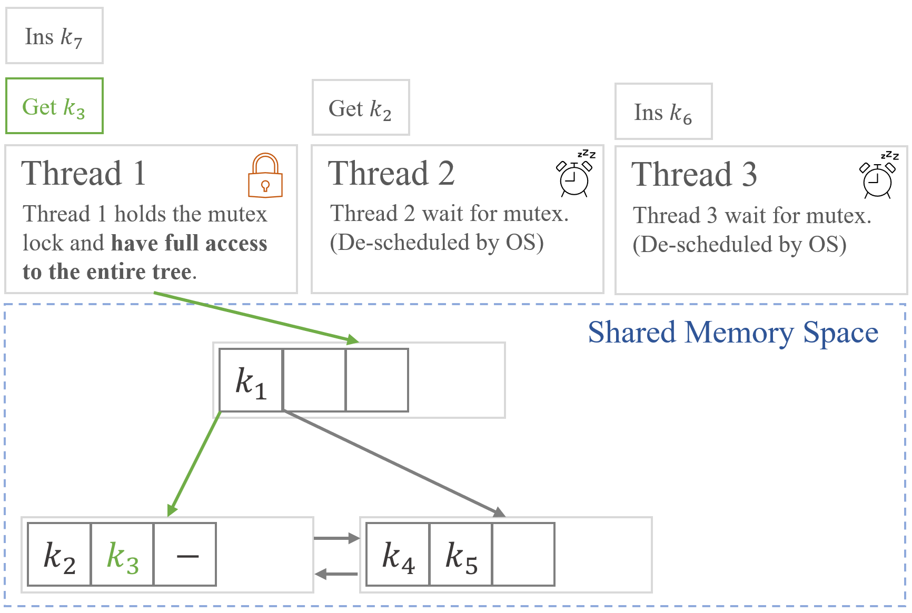

The coarse-grain B+ tree have a global `mutex` lock for the entire tree. Every time a thread calls the tree API, the thread will arbitrate for the ownership of `mutex` lock. If the thread did not acquire the lock, it will wait (and be de-scheduled by the OS).

### Fine-grain B+ Tree

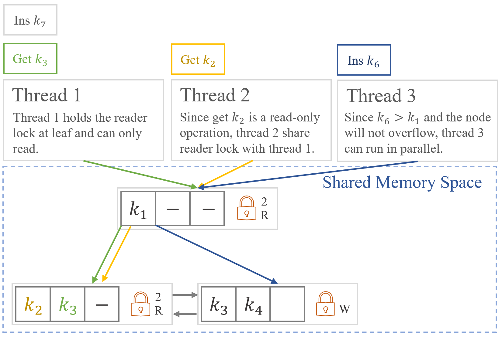

In the fine-grain B+ tree, each node have a local reader-writer lock (implemented by `std::shared_mutex`). When a thread calls read-only API (that is, the `get(T key)` method), a sequence of reader lock from root to leaf node will be acquired. 

When a thread calls write API (that is, the `insert()` and `remove()` methods), the writer locks on the path from root to leaf will be acquired *if this option can potentially cause a split, borrow or merge in the current subtree*.

This allows some thread to access subtree that are not subject to change (due to other threads' operations) and improve the parallelism of data structure.

### Latch-free Algorithm (PALM Tree)

The PALM Tree algorithm is a latch-free, asynchronous B+ tree algorithm proposed by Intel. The B+ tree process requests in batch using a group of worker thread and a single background (manager) thread.

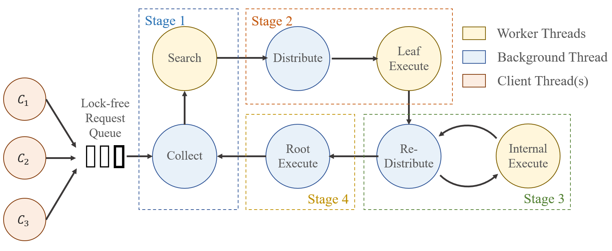

The algorithm can be divided into 4 stages in the original paper, but when implementing, we divide the algorithm into 7 different states:

* **Collect State** - at this state, all the worker threads are *busy waiting* for the signal from background thread. The background thread will collect requests from the latch-free queue in `boost::lockfree` library.

* **Search State** - at this state, background thread will *busy wait* for the signal from worker threads. The worker threads will begin to search for the leaf correspond to each `Request` and store the leaf pointer.

    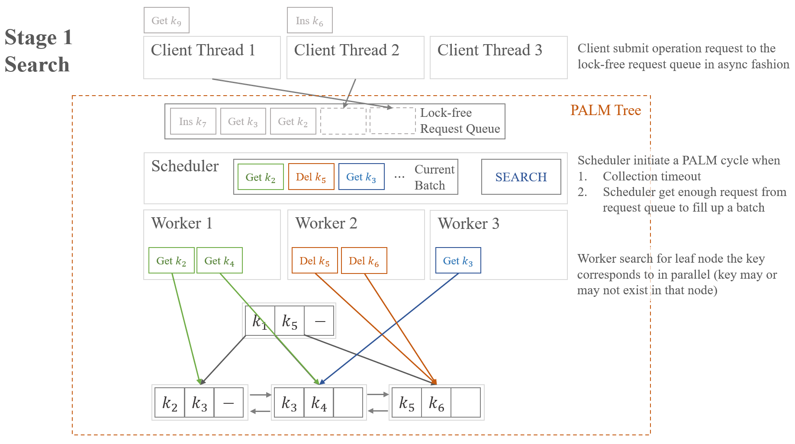

* **Distribute State** - at this state, the worker threads will busy wait for background thread to collect leaf nodes searched and reduce all requests on same leaf to each worker.

* **Leaf Execute** - worker stage execute the requests in leaf node. Insert or remove the key from the leaf node. If the node is over filled (number of keys more than or equal to order of tree) or underflow (less than half of the order), the worker thread will push a `UPDATE` request to the scheduler for next stage.

    

* **Internal Execute** - worker receive the `UPDATE` request for parent nodes and execute borrow, merge, or split operations on the children nodes.

    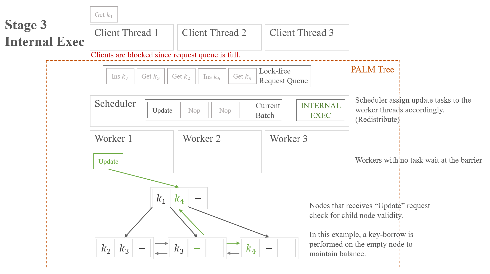

* **Root Execute** - if the root node need to be modified, the background thread will handle this modification directly to reduce the overhead of communication between worker and background threads.

### Distributed B+ Tree

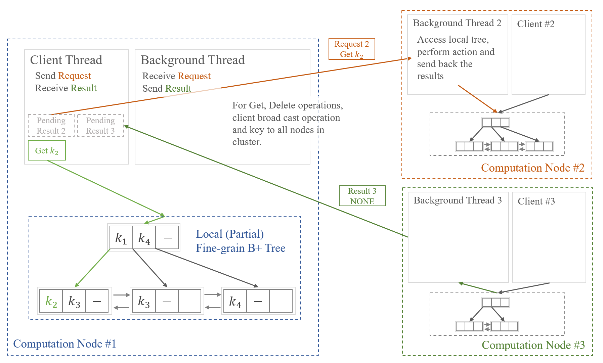

The distributed version of B+ tree is built upon the Open Message Passing Interface (OpenMPI) protocol. Every machine in the cluster (computation node or process) holds and maintain a fragment of the tree.

When the client:

* `insert` a key, the operation will be performed on local tree directly without any communication with other computation nodes. Since we decided that it is *acceptable for the distributed B+ tree to have duplicate keys*.

* `get` or `delete` a key, the operation will be broadcast to all computation nodes in the OpenMPI `COMM_WORLD` with a specific tag. So all the background threads in other nodes can receive this message and perform update / access the local tree immediately and send back result.

### Other Optimizations

* Used `SIMD` (SSE2 and ARM Neon) instruction set in key finding process in nodes.
* Used a customized spin lock barrier in PALM tree (latch-free B+ tree) implementation instead of `pthread_barrier_t` to reduce kernel call and improve latency/throughput.

## Results

<blockquote>For historical archive version of this page, please refer to this page <a href="/15-418-Final-Project/pages/archive">Link</a>.</blockquote>
